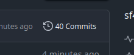

# Commit-Verlauf ansehen

Um die einzelnen Arbeitsschritte nachzuvollziehen:

1. Öffnen Sie das Repository in Ihrem Browser, z. B. `https://github.com/Benutzername/Repositoryname`.
2. Klicken Sie oben auf den Reiter **Commits** (rechts unter dem grünen „Code“-Button).

5. Klicken Sie auf einen Commit, um die geänderten Dateien und Inhalte im Detail anzusehen.

